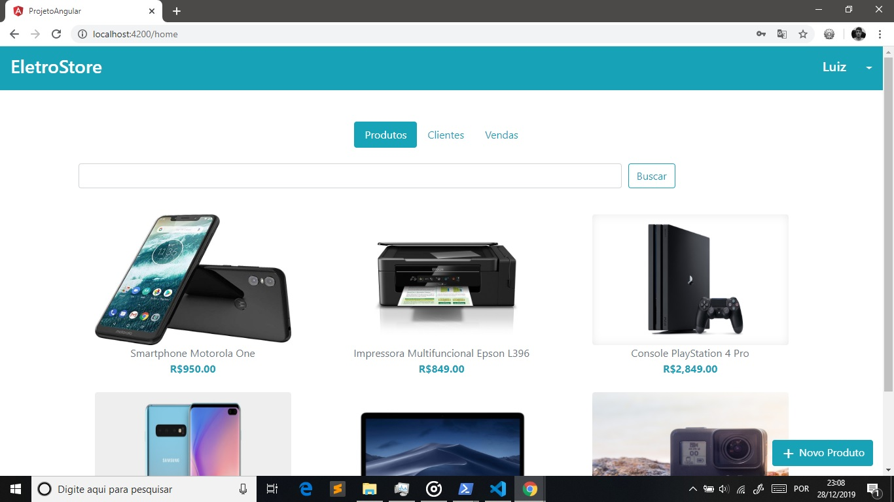
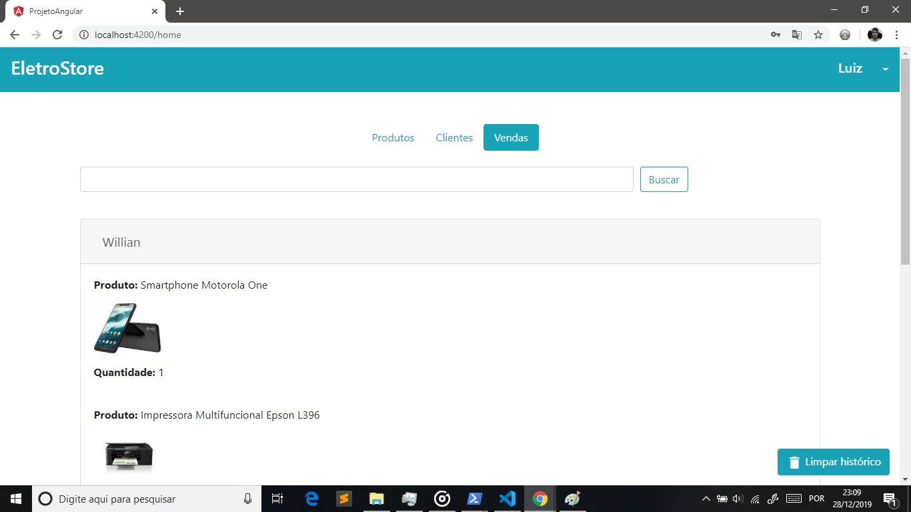
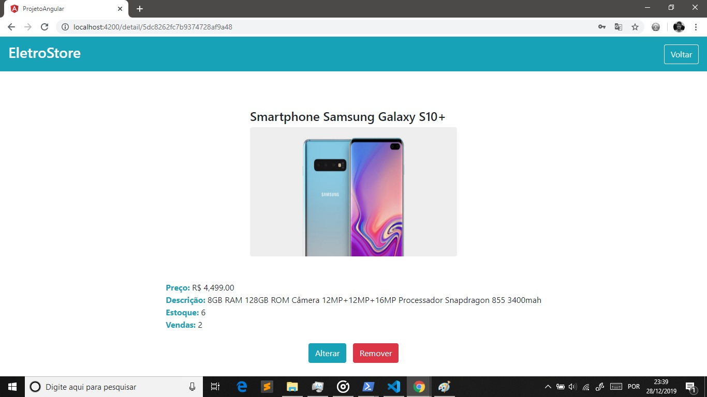
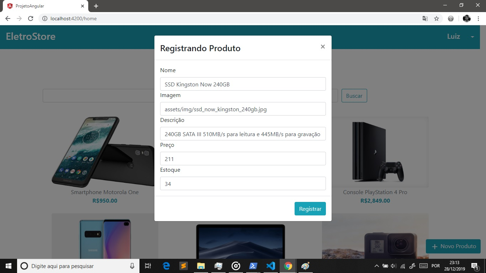
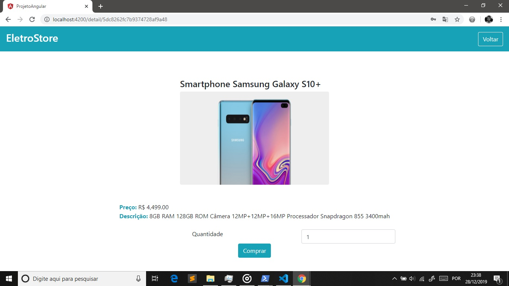
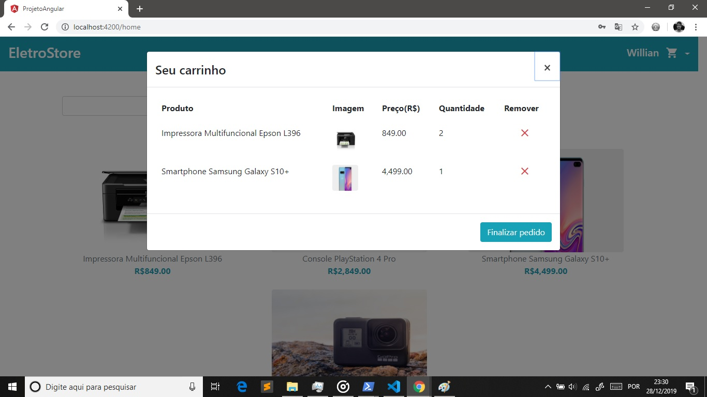

# eletrostore-ecommerce-angular
Projeto desenvolvido na disciplina de Tópicos Especais em Computação do curso de Computação(8º Período), onde fora solicitado pelo 
professor Francisco o desenvolvimento de uma aplicação relacionada ao tema *eBusiness*, sendo meu grupo responsável por abordar a 
modalidade *eCommmerce*. 

Para o desenvolvimento do projeto foi utiizada a stack **MEAN**, além do *ODM (Object Document Mapper)* **Mongoose** para fazer o 
mapeamento Objeto-Documento. 

#### Passo a passo de execução 

##### Servidor Node

Opção 1: Você pode iniciar o servidor por meio do Nodemon, que é uma dependência de desenvolvimento que reinicia o servidor automaticamente
após qualquer alteração no código-fonte. Para tal, execute o seguinte comando no terminal: **`yarn dev`** ou **`nodemon src/index.js`**

Opção 2: Você também pode iniciar o servidor da maneira tradicional, executando o comando: **`noode src/index.js`**

##### Aplicação Angular

Para executar a aplicação Anuglar, execute o seguinte comando no terminal: **`ng serve --open`**

#### ATENÇÃO: NÃO POSSUÍMOS NENHUM DIREITO AUTORAL SOBRE AS IMAGENS UTILIZADAS NESTE PROJETO; AS MESMAS FORAM UTILIZADAS COM O ÚNICO PROPÓSITO DE ESTUDO. ALÉM DISSO, AS ESPECIFICAÇÕES, DADOS E PREÇOS SOBRE OS PRODUTOS CITADOS NESTE PROJETO NÃO SÃO REAIS, SÃO APENAS DADOS ESTIMADOS, PORTANTO, NÃO DEVEM SER TOMADOS COMO LEGÍTIMOS.

###### Outros desenvolvedores: Willian Pereira Mariano

#### Capturas de tela

